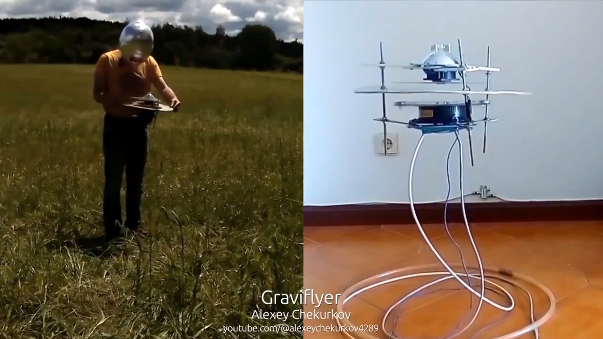

# Antigrav

A new and exciting area of research for me. This repo is dedicated to understanding "electro-gravitic propulsion". In order to do that, it will be helpful to understand:
- The classified unified-field model of physics developed decades ago
- All technology based on the understanding of it, including but not limited to, electro-gravitic propulsion and zero-point energy / overunity

The end goal is simple - to build an "electro-gravitic" flying craft. But in order to do that successfully, many other things may need to be understood.

## Contents

Background knowledge:
- `FOUNDATION-THEORY`: "Foundational" scientific knowledge.
- `EVIDENCE`: Conspiracy theories accessorizing interest in this topic.

3 key initiatives:
- `UNIFIED-FIELD-THEORY`: Understanding the unified "aether" theory that has been developed and classified over the last several decades.
- `ANTIGRAVITY`: Understanding alternative "electro-gravitic" propulsion methods.
- `FREE-ENERGY`: So-called "zero-point energy" (ZPE) / overunity explained by unified field theory.

Auxiliary initiative:
- `WEAPONS-TOOLS`: Information about other devices that can be understood using this knowledge.

Auxiliary resource folders:
- `MEDIA`: Monolithic folder for information from various sources on this topic, organized by author/source.
- `personal-evolution`: A more generic media folder which contains media I found interesting.

## Additional topics

- Nuclear fusion
- Wormholes

# Inspiration and justification

The "dead-body" irrefutable evidence inspiring this entire inquiry is Alexey Chekurkov's Graviflyer. There is substantial evidence suggesting that this craft is legitimate, from which we can assume that "electro-gravitic" propulsion is indeed possible. This opens up an entire can of worms regarding all the other related, potentially "fake" stories such as Vimanas and secret US technology.

# Structure of inquiry

Since this is such a broad topic, it will be easy to drift down bottomless "rabbit holes" aimlessly. Additionally, there is so much noise on this topic - word salads completely untethered to reality, disinformation, attention-farming, and the like.

Therefore the inquiry should be structured around understanding the principles of electro-gravitic propulsion so far as they can help us construct a working electro-gravitic propulsion craft.

# Basic working principles

## 1. Everything is in plain sight waiting for us to see it.

Everything already exists and happens perfectly as it should, and there is no other way it could work, even if we can't understand it. All we have to do is discover what exists in front of our eyes in plain sight. We are blind as we can only see certain frequencies (light) in a caricature cross-section with our eyeballs, but we will have to use our brain to expand our vision to other frequencies.

Those hallucinatory fractal visuals? Yeah. That's what the universe ACTUALLY is. But our primitive eyes only see a cross section of reality.

## 2. Everything is one. There are no boundaries.

We are simply a part of the "aether" - what we think of as "us" is actually just a waveform biosystem, permeable to the outside elements. "We" don't actually exist, "we" are an abstraction created by our minds, in our thoughts.

## 3. Conservation of forces.

Conservation of "things" - for everything there is an equal and opposing thing. Words are too often, childish and simplish, one-dimensional descriptions of multi-dimensional, balanced systems, and too often describe rather than explain.

Unified field theory should explain this well.

## 4. Mainstream "science" is like a children's book - a caricature, lying by omission.

Everything we are told about science may be a lie. Tesla coils, gravity, magnetism, the explanations are all inadequate. Everything in the public sphere is a dumbed down, "kids story" version.

## 5. The big things are just accumulations of the small things

Always.

# Key terms

electrogravitics
anti gravity

# TODO

Check that antigravity USA doc with all the testimonies posted by tom hudson
